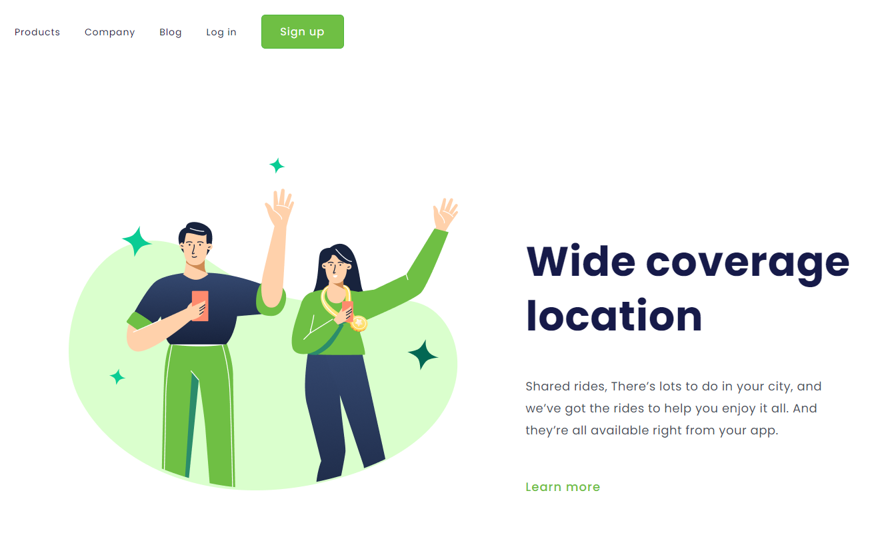

<h1 align="center">:file_cabinet: Wide Coverage Location - Landing Page <h1>

## :memo: Descrição
Essa Landing Page foi criada inicialmente para praticar os conceitos básicos de HTML e CSS (desde a estilização até a responsividade).

* Segue link da aplicação: https://davi-aalves.github.io/wide-coverage-location-landing-page/

## :wrench: Tecnologias utilizadas
* HTML;
* CSS;

## :soon: Implementação futura
* Após desenvolver meus conhecimentos em JavaScript pretendo adicionar novas funcionalidades para praticar.

## :handshake: Colaboradores
<a href="https://github.com/davi-aalves">Davi Alves</a>

## :dart: Status do projeto
Em aprimoramento.
